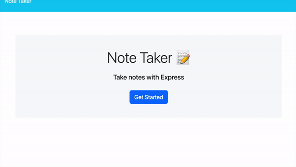

# A Note Taker App by Coffee Pawz 

## Heroku Deployed Link 

[Click Here](https://coffee-pawz-note-taker-app.herokuapp.com/)

## Description 

Do you ever have an amazing coffee thought!? That feeling when you are spacing out while sipping on a cup of coffee and then think "Oh! I should write that down!" 

BUT WHERE should I write them down!?

The Note Take app offers the perfect solution! 

The Note Taker application can be used to write and save notes. Using an Express.js back end, this app will save and retrieve your stored notes (each having a unique ID!) from a JSON file. The application has been deployed using Heroku. 

## Installation 

Log on to the deployed [Link](https://coffee-pawz-note-taker-app.herokuapp.com/) in your web browser and get writing! 

## Usage 

Click the "Get Started" button to begin! 

You will be brought to a page that has a blank note in the right column. Start typing your note! Begin with typing a title for you note, then add in details below in the "Note Text" area. 

As you begin typing in the "Note Text" area a button will appear on the top right that looks like an old school floppy disc. When you are done typing your note, and you will see the title of the note appear in the left column. That note will now be saved there! 

Leave the page and come back, the note will still be there! Just click on the note title and you will be able to see it in the right column. 

When you are ready to add a new note, click the "Plus Sign" in the top right corner, and get writing! 

## Credits 

Laura Duffy aka Coffee Pawz
Email: lauraduffy700@gmail.com
GitHub: [duffylaura](https://github.com/duffylaura)

## License 

MIT License. 

